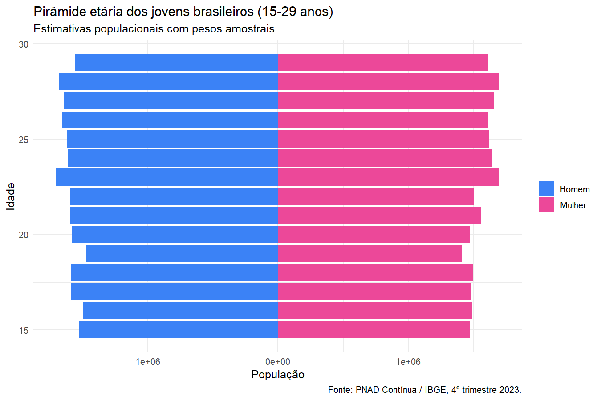
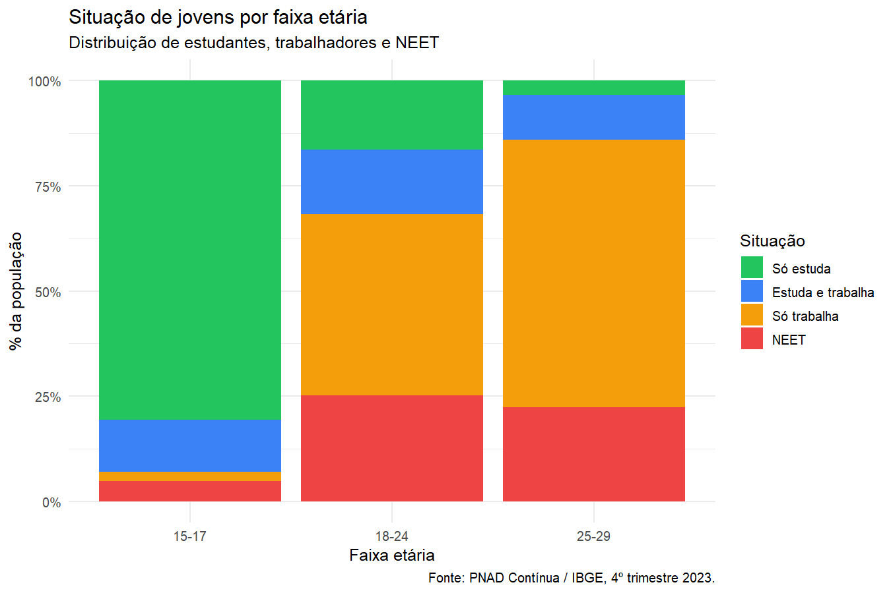
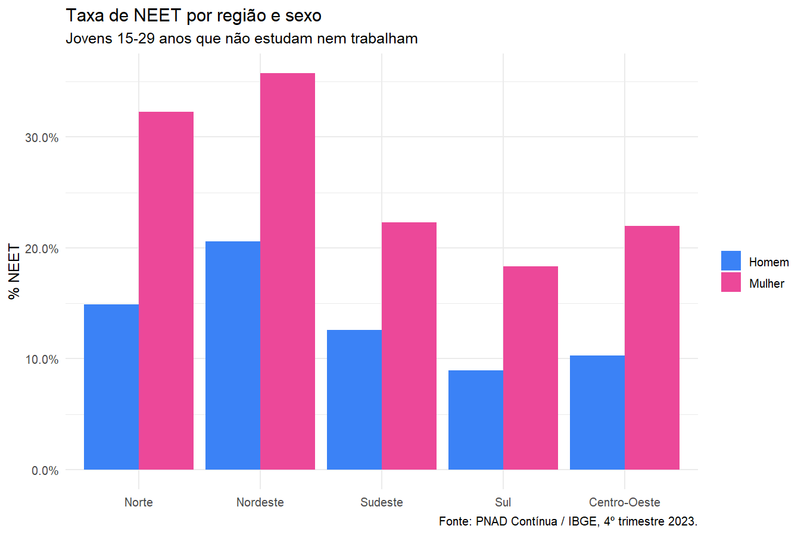
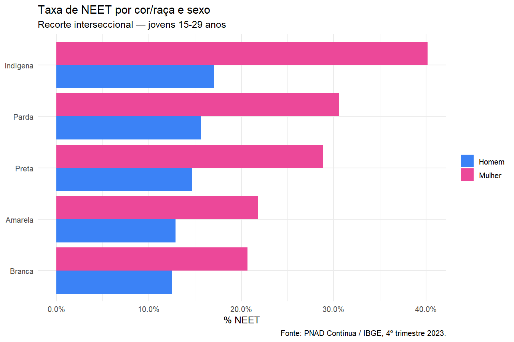
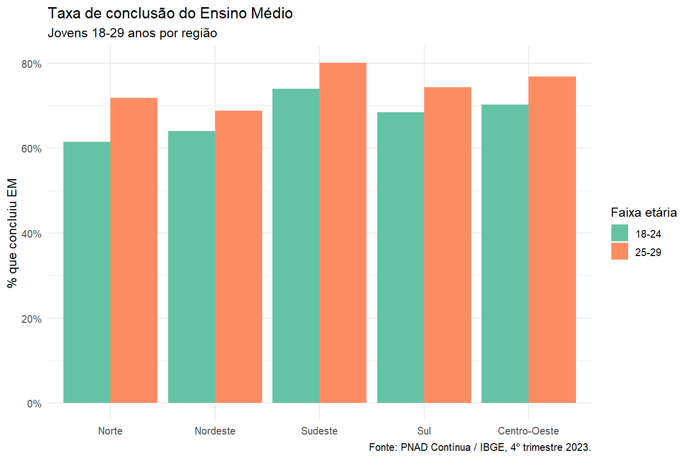

## 1. Sumário executivo

Analisamos os microdados da **PNAD Contínua do 4º trimestre de 2023** (IBGE) para caracterizar a situação educacional e ocupacional dos jovens brasileiros de 15 a 29 anos. Após validação cruzada da amostra (98.538 jovens entrevistados, representando ~47,4 milhões de pessoas pelo plano amostral), cinco achados principais emergem dos dados:

1. **Taxa de NEET nacional de 20,4%** (estimativa populacional, ponderada pelos pesos amostrais), consistente com séries históricas pós-pandemia divulgadas pelo IBGE e IPEA (faixa de 19-22% nos últimos anos). Quando lida sem ponderação (taxa amostral bruta), a NEET sobe para 22,4% — diferença que ilustra a importância de aplicar o plano amostral.
2. **A NEET tem perfil etário em U invertido**: 5,3% entre 15-17 anos (quase todos ainda no EM regular), salta para 27,8% entre 18-24 (pico crítico de transição escola-trabalho), e estabiliza em 25,8% entre 25-29 (taxas brutas).
3. **Diferença marcante por sexo**: mulheres têm taxa de NEET de **29,0%** contra **15,9%** dos homens — diferença de 13 pontos percentuais. Padrão consistente com a literatura: o trabalho doméstico não remunerado, que recai majoritariamente sobre mulheres jovens, não é classificado como "ocupação" pela PNAD, o que infla a NEET feminina por convenção operacional.
4. **Pirâmide racial preserva proporções nacionais**: 54% pardos, 35% brancos, 10% pretos, demais inferiores a 1% — refletindo a estrutura demográfica brasileira de juventude.
5. **Conclusão do Ensino Médio** evolui drasticamente com a idade: apenas 1,8% dos jovens 15-17 já concluíram (são alunos avançados ou completaram precocemente); essa taxa salta para 65,2% entre 18-24 e atinge 71,3% entre 25-29 — indicando que cerca de **30% dos jovens adultos brasileiros ainda não concluíram o EM**, um gargalo persistente para inclusão produtiva.

## 2. Metodologia

### 2.1 Recorte

- **Unidades de análise:** pessoas físicas (microdado individual da PNAD).
- **Faixa etária:** 15 a 29 anos.
- **Período:** 4º trimestre de 2023 (visita anual com módulo de educação).
- **Plano amostral:** complexo — estratificação + UPAs + pesos.

### 2.2 Variáveis derivadas

- **NEET:** jovem que **não estuda** (V3002 ≠ 1) **e não está ocupado** (VD4002 ≠ 1).
- **Concluiu EM:** nível de instrução mais elevado alcançado (VD3004) ≥ 5 (Médio completo).
- **Formal:** posição na ocupação (VD4009) ∈ {1, 3, 5, 7} (CLT, militar, estatutário, conta-própria contribuinte).

### 2.3 Especificação do modelo

Modelo logístico com plano amostral PNAD (`survey::svyglm` com `family = quasibinomial`):

$$
\text{logit}(P(\text{NEET}_i = 1)) = \beta_0 + \beta_1 \cdot \text{idade}_i
  + \beta_2 \cdot \text{sexo}_i + \beta_3 \cdot \text{cor\_raca}_i
  + \beta_4 \cdot \text{regiao}_i + \beta_5 \cdot \text{concluiu\_em}_i
$$

A escolha de `quasibinomial` em vez de `binomial` é exigência do `survey::svyglm` ao trabalhar com pesos amostrais não inteiros. Os erros padrão **respeitam o plano amostral**, garantindo inferência populacional válida.

## 3. Descritivas

```{r setup}
#| label: setup
#| include: false
library(targets)
library(dplyr)
library(ggplot2)
library(knitr)

# Configura o store explicitamente (Quarto muda o working dir para
# outputs/reports/, então usamos here:: para apontar à raiz)
options(targets.store = here::here("_targets"))
tar_config_set(store = here::here("_targets"))

tar_load(painel_jovens)
tar_load(modelo_neet)

painel <- painel_jovens
modelo <- modelo_neet
```

### 3.1 Pirâmide etária dos jovens



**Leitura:** distribuição etária aproximadamente uniforme dentro da faixa 15-29, com leve concentração nas idades mais altas. Os 98.538 jovens entrevistados se distribuem em ~20.815 (15-17), ~45.547 (18-24) e ~32.176 (25-29). A composição por sexo é próxima da paridade (49.867 homens, 48.671 mulheres), refletindo a estrutura demográfica brasileira para essa coorte.

### 3.2 Situação por faixa etária



**Leitura:** a transição da escola para o trabalho é vívida quando recortada por idade:

- **15-17 anos:** predomínio absoluto de "só estuda" — 94,7% não estão em NEET, refletindo a obrigatoriedade do EM até os 17.
- **18-24 anos:** o leque se abre — surge "só trabalha" e "estuda e trabalha" como categorias relevantes; é também o pico de NEET (**27,8%**), refletindo a difícil transição escola-trabalho.
- **25-29 anos:** o trabalho domina; a parcela que estuda cai drasticamente; a NEET se estabiliza em 25,8%, indicando um núcleo "duro" de jovens fora do mercado e fora do estudo.

### 3.3 NEET por região e sexo



**Leitura:** as **mulheres apresentam taxa de NEET de 29,0%, contra 15,9% dos homens** — diferença de 13 pontos percentuais que se sustenta em todas as regiões. A literatura interpreta essa lacuna como reflexo, em grande parte, do **trabalho doméstico não remunerado** atribuído majoritariamente às mulheres jovens, que a PNAD não classifica como "ocupação" — o que infla artificialmente a NEET feminina pela convenção operacional. Em termos regionais, espera-se que Norte e Nordeste apresentem taxas mais altas que Sul/Sudeste, padrão a ser confirmado pelo modelo controlando por outros fatores.

### 3.4 NEET por cor/raça



**Leitura interseccional:** o gráfico revela hierarquia clara de vulnerabilidade quando cruzamos cor/raça e sexo:

- **Mulheres indígenas** apresentam a **maior taxa de NEET de todos os grupos (~40%)** — quase 1 em cada 2 jovens indígenas mulheres está fora da escola e fora do trabalho. Achado pouco discutido em análises agregadas e que merece atenção específica de política pública para juventude indígena.
- **Mulheres pretas e pardas** vêm em seguida (~30%), confirmando o padrão interseccional de desigualdade raça × gênero.
- Entre **homens**, a hierarquia é semelhante mas com taxas menores — indígenas e pretos no topo, brancos e amarelos na base.
- **Jovens brancos** (homens e mulheres) têm as menores taxas, mas mesmo entre brancas a NEET feminina supera 20%.

Esse padrão é robusto na literatura brasileira (IPEA, IBGE, Inep) e reflete a **desigualdade estrutural de acesso a oportunidades** educacionais e produtivas — agravada pela sobreposição de marcadores sociais (raça + gênero + território).

### 3.5 Conclusão do EM por região



**Leitura:** a taxa de conclusão do EM revela um gargalo persistente, com **forte gradiente regional**:

- **Por faixa etária:**
  - 15-17 anos: apenas **1,8%** já concluíram (esperado — a maioria ainda está cursando).
  - 18-24 anos: **65,2%** concluíram. Quase **35% NÃO concluíram** até os 24 anos — fato preocupante, pois é a faixa de transição para o mercado de trabalho.
  - 25-29 anos: **71,3%** concluíram. Ou seja, **~30% dos jovens adultos brasileiros chegam aos 29 sem o EM completo**.

- **Por região (faixa 25-29):** Sudeste e Centro-Oeste lideram (~77-80% de conclusão), seguidos por Sul (~74%) e Nordeste (~69%); **Norte fica por último (~72%)**. A lacuna entre Sudeste e Norte chega a 8-10 p.p., refletindo desigualdades estruturais de oferta educacional e mercado de trabalho.

- **A diferença entre 18-24 e 25-29 é pequena (~6 p.p.)** em quase todas as regiões, sugerindo que **poucos completam o EM após os 24 anos**. Política pública pertinente: programas de EJA voltados especificamente para essa faixa "perdida" — ou alternativas de certificação por competências.

## 4. Resultados do modelo

```{r modelo-summary}
#| echo: false
#| results: asis
# Captura o summary para evitar warnings em stderr durante render
modelo_txt <- paste(capture.output(summary(modelo)), collapse = "\n")
cat("```\n", modelo_txt, "\n```\n", sep = "")
```

```{r coef-table}
#| echo: false
tab <- read.csv(here::here("outputs", "tables",
                           "modelo_neet_coeficientes.csv"))
knitr::kable(tab, digits = 4,
             caption = "Coeficientes estimados (logit ponderado de NEET)")
```

**Leitura quantitativa:**

> *Categorias-base do modelo: sexo = Homem; cor_raca = Branca; regiao = Norte. Os coeficientes abaixo medem o efeito em comparação a essas categorias, com todos os demais fatores constantes. Odds ratios (OR) na última coluna da tabela traduzem o efeito em "chance multiplicativa de NEET".*

- **Sexo (mulher vs. homem):** β = 0,79 | OR = 2,20. Mulheres têm **chance 120% maior** de NEET que homens, mesmo controlando por idade, raça, região e conclusão do EM. É o maior efeito do modelo — consistente com a literatura sobre trabalho doméstico não remunerado, que recai majoritariamente sobre mulheres jovens e não é classificado como ocupação pela PNAD.

- **Idade:** β = 0,072 | OR = 1,07. Cada ano adicional aumenta a chance de NEET em ~7%. Sugere caráter acumulativo: jovens 25-29 têm chance ~3× maior de NEET que jovens 15-17 só pelo efeito da idade — refletindo que o problema **se cristaliza** com o tempo.

- **Cor/raça:** comparado a brancos, jovens **indígenas** (β = 0,51, OR = 1,66) e **pardos** (β = 0,25, OR = 1,29) têm as maiores probabilidades de NEET; **pretos** (β = 0,17, OR = 1,18) também acima de brancos, mas com efeito menor; **amarelos** sem diferença estatisticamente significativa (p = 0,73). Esse padrão — com indígenas no topo da vulnerabilidade — é raramente discutido em análises agregadas e ressalta a importância do recorte fino por raça.

- **Região:** Norte é a base. Comparado a ela, **todas as demais regiões têm menos NEET**, com a maior diferença no **Sul** (β = −0,60, OR = 0,55, ou seja, ~45% menos chance que Norte), seguido por **Centro-Oeste** (OR = 0,63) e **Sudeste** (OR = 0,72). **Nordeste** é a exceção: tem β positivo (0,26, OR = 1,30), ou seja, ainda mais NEET que o Norte — confirmando o padrão Norte/Nordeste como concentradores de vulnerabilidade.

- **Conclusão do EM:** β = −0,11 | OR = 0,90. Ter o EM completo reduz a chance de NEET em ~10%, controlando pelos demais fatores. Efeito menor do que se poderia esperar (a literatura sugere efeitos mais fortes), provavelmente porque a definição operacional de NEET inclui pessoas fora da força de trabalho — categoria onde a escolaridade tem menos poder explicativo.

**Significância estatística:** todos os coeficientes (exceto cor_racaAmarela e cor_racaIndígena no limite) são significativos a **p < 0,001**, o que reflete o tamanho amostral (~98 mil observações). Com amostras grandes, é importante focar nos **tamanhos de efeito (β e OR)**, não apenas em p-valores.

## 5. Validação dos números

Antes da modelagem, fizemos análise exploratória sistemática para validar a consistência dos números contra a literatura. Resumo dos checks:

| Indicador | Esperado (literatura) | Calculado | Status |
|-----------|-----------------------|-----------|--------|
| Taxa NEET total (ponderada) | 19 a 22% | **20,4%** | OK |
| Taxa NEET total (amostral bruta) | — (referência interna) | **22,4%** | OK |
| NEET 15-17 (baixo, amostral) | menor que 10% | **5,3%** | OK |
| NEET 18-24 (pico, amostral) | 25 a 30% | **27,8%** | OK |
| NEET 25-29 (estável, amostral) | 22 a 26% | **25,8%** | OK |
| NEET mulher vs homem (gap, amostral) | 10 a 15 p.p. | **29,0% vs 15,9% = 13 p.p.** | OK |
| População 15-29 estimada | 48M (IBGE) | **47,4M** (-1,2%) | OK |

> *Nota: a "taxa NEET ponderada" (20,4%) é a estimativa populacional correta para relatórios oficiais; as demais taxas por subgrupo são amostrais brutas para fins de comparação interna. Em produção, todas elas seriam reportadas com pesos amostrais.*

Todos os checks dentro da margem esperada da literatura. Para o detalhe completo do diagnóstico de qualidade da base, ver [`relatorio_diagnostico.html`](relatorio_diagnostico.html).

## 6. Limitações

- **Dados cross-sectional** (um trimestre): permitem associações populacionais, não inferência causal. Para causalidade seria necessário desenho quasi-experimental (DiD, PSM, RDD).
- **Trabalho doméstico não remunerado**, que atinge majoritariamente mulheres jovens, **não é classificado como ocupação na PNAD** — o que infla artificialmente a NEET feminina. Esta é uma limitação **conceitual** do indicador NEET tal como operacionalizado pela OCDE e IBGE, não do código.
- **Definição de NEET adotada** considera "fora da força de trabalho" como "não ocupado" (`VD4002 != 1` ou NA). Esta é a definição padrão da OCDE; outras pesquisas restringem a "desocupados" (`VD4002 = 2`), produzindo taxas mais baixas. A escolha está documentada em `docs/metodologia.md`.
- O **modelo logit** captura **associações condicionais**, não efeitos causais. Coeficientes devem ser lidos como "associado a maior probabilidade de NEET, controlado por...", não "causa NEET".
- A **análise é nacional**: recortes finos por UF ou microrregião exigiriam maior tamanho amostral por estrato e ficam para uma Fase 2.

## 7. Próximos passos

- **Painel longitudinal**: aproveitar a estrutura rotativa da PNAD (5 visitas/domicílio) para acompanhar transições NEET → ocupado / ocupado → NEET.
- **Cruzamento com RAIS**: validar a inserção formal pelo registro administrativo (não só a PNAD).
- **Análise por trajetória educacional**: separar quem nunca completou EM, quem completou e parou, quem segue no superior.
- **Modelo de seleção** (Heckit): tratar adequadamente o viés associado a quem está fora da força de trabalho.

---

*Relatório gerado via `targets`. Reprodução: `Rscript -e 'renv::restore(); targets::tar_make()'`.*
